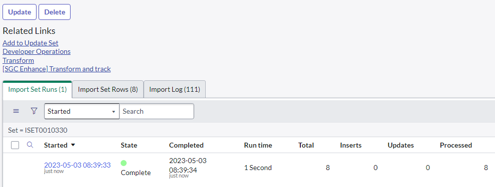

# SGC Enhancement Suite
**The SGC Enhancement Suite is a custom-scoped application designed to help implement and test Service Graph Connectors by allowing admins to import and roll back their CMDB data and gain insights on where their data is landing in the CMDB after imports.**
## About
Service Graph Connectors are the primary methods to get CI data into  your ServiceNow CMDB. As apposed to your typical ServiceNow integration, the Service Graph Connector follows a specific framework laid out by ServiceNow to ensure that all integrations play by the same rules allowing for a consistent multi source CMDB. 

This framework primarily consist of using Flow Designer Data Stream Actions to load data into staging tables and then transforming that data through the Robust Transform Engine (RTE) which uses the Identification and Reconciliation Engine (IRE) to update and insert records into the CMDB while following ServiceNow best practices. 

Although Service Graph Connectors are meant to be easy to set up and start using, depending on the current state of your CMDB this isn't always the case, there are often custom identification rules in place or the source data is not 100% reliable. Once the data is in the CMDB and you find things aren't where they should be, its very hard to untangle.

The SGC Enhancement Suite helps with this by utilizing the out of box platform features to help admins run imports and get full visibility on where that data is going. And if things don't appear as expected, the SGC Enhancement Suite allows you to roll back entire import sets to make it like it never even happened.

**Features:**

 - Transform import sets.
 - Export transform summaries for import set runs.
 - Roll back import set runs.
 - Transform and roll back individual import set rows.
 - Review target data for each import set row.
 - Review source IDs on CI records.

## Run a transform through the SGC Enhancement Suite.
To utilize the majority of the features with the SGC Enchantment Suite, import set's need to be processed using through the tool itself. This is necessary because the SGC Enhancment Suite utilizes the **sn_integration_studio.IntegrationStudioScriptableApi** to do its processing which allows for the ability to generate transform summaries as well as roll back import set runs.

Here are the ways to run this process.
### Transform and track an import set
If you have an existing import set, you can simply navigate to it and click the **[SGC Enhance] Transform and track** UI Action. You can use this regardless if the Import set has already been processed or its only been loaded, the appropriate states for the import set and rows will be handled automatically.

**Note:** Don't use the out of box "Reprocess" or "Transform" UI Actions since these will not allow you to perform a roll back or generate an import summary export. 

The import runs asyncrounusly so and you can monitor the progress of the import under the **Import Set Runs** tab on the import set or in the **Transform History** module.

Because running a transform through this process utilizing more ServiceNow reporting and logging, exect for the run time of this process to take longer than if you had just ran the import through the regular process.
### Run a full import
If there is no import set currently available, you can execute a full import like you normally would through the scheduled data import record. If you navigate to the Scheduled Data Import record that you want to track imports for, you can use the **[SGC Enhance] Run full import** UI Action instead of using the "Execute Now" button.

**Note:** If there are child Scheduled Data Imports related to the selected job, those child jobs will not be executed and will have to be individually executed for each job that you want to track.
### Tranform a single import set row
If you are testing things out or are trying to debug an individual issue, you can transform import set rows individually using the **[SGC Enance] Transform this row** UI Action. This will still allow you to perform a roll back later on but helps keep things simple when first working with a new connector.

## Perform a rollback
After an import has completed, the SGC Enhancement Suite receives a rollback context ID which allows us to roll back the completed import to the CMDB's previous state.
### Roll back an import set run
Either from the transform history table or by reviewing the import set run's for a spesific import set, navigate to the transform history once the processing is complete. Use the **[SGC Enhance] Roll back** UI Action to begin the roll back. 

You can monitor the progress of the rollback by simply watching the total processed count on the tranform history record count backwards to 0 or empty. The Transform History record does not get deleted though.

### Roll back an import set's most recent run
Simply for convenience, you can additionally perfrom a rollback from the import set record using the **[SG Enhance] Roll back most recent run** UI Action. This will look at the most recent import set for this import set and perform the rollback.

### Roll back a single import set row
When you transform a single import set row, an import set run record is also created with just one row in it for processing. You can roll back that transform history record but once the row is finished processing, you can also use the **[SGC Enhance] Roll back this row** UI Action. 

## Generate and Export an Import Summary
The SGC Enhancement Suite aims to add more visibility to the data you are importing through Service Graph Connectors. One of the ways it can do this is by allowing you to export a CSV summary of an import set that goes row by row of the set going into detail which CMDB records were created or if any IRE errors were encountered. The CSV can be exported so that it can be shared more easily as well as not prevent you from performing a rollback after the transform completes.

To generate this export, navigate to the Transform History that you have run through the SGC Enhancment Suite. Click the **[SGC Enhance] Get Import Summary** UI Action to begin generating the file. This process happens in the background so it may take between a few seconds or a few minutes depending on the size of the import.

Once the summary  has been generated, the CSV file will be automatically attached to the same Transform History record.

Download the attachment to review the Import Set Run Summary.

The CSV file is laid out in the oder of the import set rows by row number in ascending order.
File columns include:

 - **Row Number**: The row number reflected on the import set row record.
 - **Staging row columns**: The source data values that were processed through the transform.
 - **Target Table**: The CMDB table the RTE inteded to map this row to.
 - **Actual Table**: The ServiceNow table this row ended up targeting at runtime.
 - **Operation**: Shows what database operation was performed by the IRE.
 - **Target Display**: The display value of the CMDB record that was targeted by the IRE.
 - **Target Record**: The sys_id value of the CMDB record that was targeted by the IRE.
 - **Target Link**: A link value to make it easier to navigate to the target CMDB record.
 - **Error**: Reported errors that could have occurred from the RTE or IRE.
 - **Warning**: Reported warnings that could have occurred from the RTE or IRE.
 
 
 

